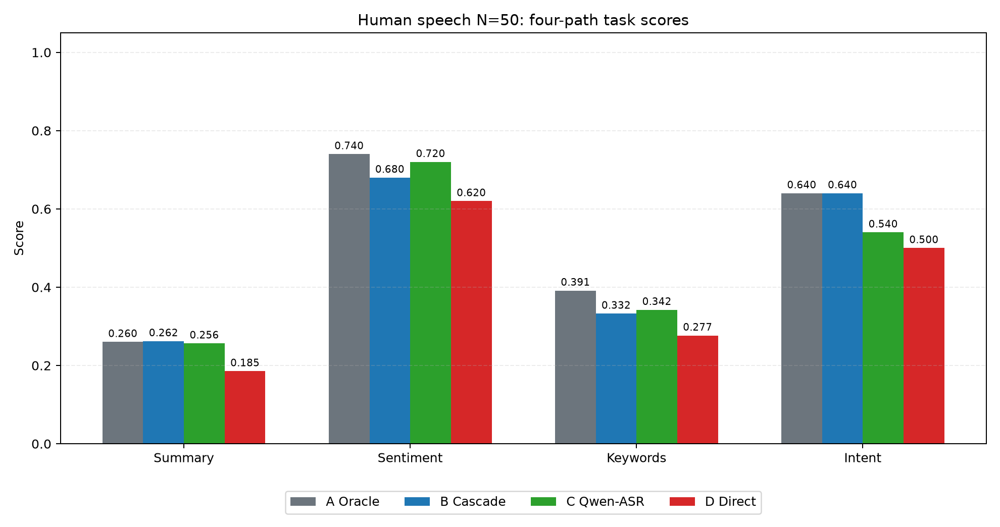
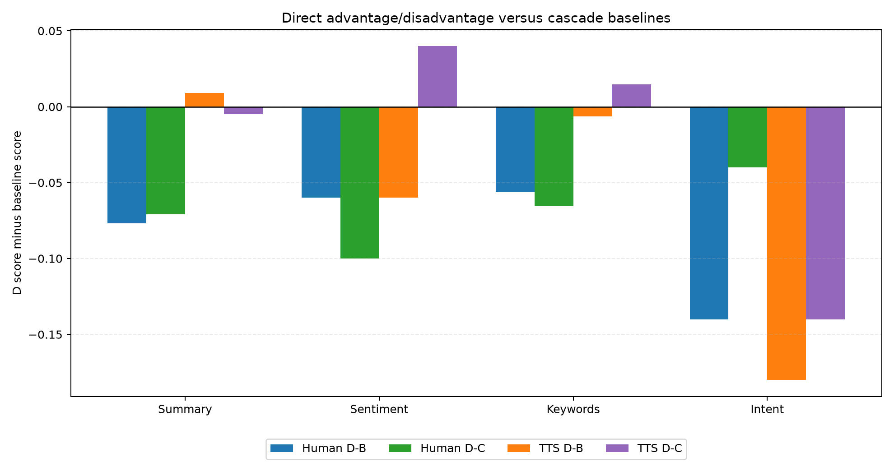
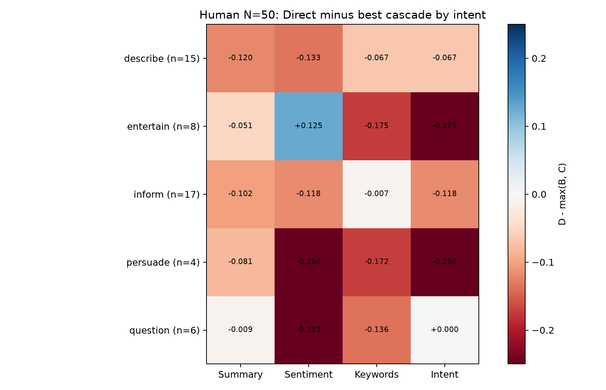
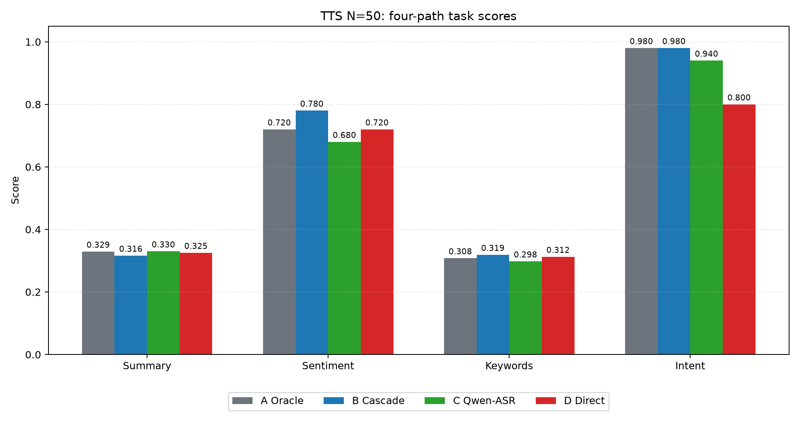

# N=50 人声与 TTS 四路径语音理解报告

**作者：** Jiayi Li（李佳宜）、Liu Luofei（刘洛菲）、Zhang Yuchen（张予辰）  
**日期：** 2026-07-08  
**任务：** 摘要、情感、关键词、意图  
**路径：** A Oracle、B Whisper 级联、C Qwen 转写级联、D Qwen Direct

## 1. 数据口径

本报告采用两个各 N=50 的集合：

- **人声 N=50：** 从现有 N=66 人声结果中剔除 16 条真实意图为 `describe` 的非 v5 样本；v5 的 9 条样本全部保留，并使用 `rensheng_results.json` 中另一台电脑的四任务结果作为 v5 最终结果。
- **TTS N=50：** 使用 `TTS_50_results.json` 中的 50 条 Microsoft Edge TTS 样本结果。

人声最终意图分布：`{'describe': 15, 'entertain': 8, 'inform': 17, 'persuade': 4, 'question': 6}`。  
TTS 最终意图分布：`{'describe': 8, 'entertain': 8, 'inform': 19, 'persuade': 9, 'question': 6}`。

## 2. 人声 N=50 结果

| 路径 | 摘要 ROUGE-L | 情感准确率 | 关键词 F1 | 意图准确率 |
|---|---:|---:|---:|---:|
| A Oracle（人工文本→DeepSeek） | 0.2601 | 74.0% | 0.3914 | 64.0% |
| B Cascade（Whisper→DeepSeek） | 0.2621 | 68.0% | 0.3325 | 64.0% |
| C Qwen转写→DeepSeek | 0.2564 | 72.0% | 0.3421 | 54.0% |
| D Direct（Qwen音频直推） | 0.1854 | 62.0% | 0.2765 | 50.0% |

人声中，A/B/C 仍然整体强于 D。最重要的是：D 并不是全面失败，它在部分情感场景有信号；但作为通用四任务方案，显式转写后交给 DeepSeek 的级联路径更可靠。

| 任务 | D-B | D-C | 解释 |
|---|---:|---:|---|
| 摘要 | -0.0767 | -0.0710 | Direct 落后 |
| 情感 | -0.0600 | -0.1000 | Direct 落后 |
| 关键词 | -0.0559 | -0.0656 | Direct 落后 |
| 意图 | -0.1400 | -0.0400 | Direct 落后 |

### 2.1 人声路径优劣

- **A Oracle** 是文本上限。它通常最高，说明任务本身更偏文本语义理解，而不是单纯声学识别。
- **B Whisper 级联** 是最稳的实用路径。它在摘要和意图上非常强，且不依赖 Qwen2-Audio 的直接任务遵循能力。
- **C Qwen 转写级联** 证明问题不只是 Whisper/Qwen 的 ASR 差异。即使用 Qwen 做转写，再让 DeepSeek 做文本任务，结果仍然明显强于 Qwen Direct。
- **D Direct** 的优势集中在少数情感判断场景，尤其是 v5 中的脱口秀/娱乐类语音；但在关键词和意图上明显吃亏。

### 2.2 人声中特定 intent 的 Direct 信号

`entertain` 是 Direct 最值得继续追的场景：

| 路径（entertain） | 摘要 | 情感 | 关键词 | 意图 |
|---|---:|---:|---:|---:|
| B_whisper_cascade | 0.2003 | 25.0% | 0.2679 | 62.5% |
| C_qwen_transcript | 0.2062 | 37.5% | 0.3232 | 25.0% |
| D_qwen_direct | 0.1552 | 50.0% | 0.1483 | 25.0% |

在人声 `entertain` 子集上，D 的情感准确率高于 B/C。这支持一个更积极的判断：**当语气、笑点、讽刺和表演性比纯文本更重要时，端到端音频模型可能捕捉到级联转写丢失的线索。**

但是，D 在同一 `entertain` 子集的摘要、关键词和意图上仍然落后。也就是说，Direct 的现有优势更像是“声学情绪线索优势”，不是完整语义理解优势。

## 3. TTS N=50 结果

| 路径 | 摘要 ROUGE-L | 情感准确率 | 关键词 F1 | 意图准确率 |
|---|---:|---:|---:|---:|
| A Oracle（人工文本→DeepSeek） | 0.3291 | 72.0% | 0.3079 | 98.0% |
| B Cascade（Whisper→DeepSeek） | 0.3160 | 78.0% | 0.3188 | 98.0% |
| C Qwen转写→DeepSeek | 0.3299 | 68.0% | 0.2978 | 94.0% |
| D Direct（Qwen音频直推） | 0.3251 | 72.0% | 0.3124 | 80.0% |

TTS 的结论更直接：**级联路径明显更强，尤其是意图识别。** B 的意图准确率达到 98%，D 为 80%。在合成、清晰、无环境噪声的语音里，Direct 没有从声学信息中获得额外收益，反而暴露出任务遵循和标签稳定性问题。

| 任务 | D-B | D-C | 解释 |
|---|---:|---:|---|
| 摘要 | 0.0091 | -0.0048 | Direct 落后 |
| 情感 | -0.0600 | 0.0400 | Direct 落后 |
| 关键词 | -0.0064 | 0.0146 | Direct 落后 |
| 意图 | -0.1800 | -0.1400 | Direct 落后 |

## 4. 人声 vs TTS 的对照

两组 N=50 指向同一个主结论：**如果目标是摘要、情感、关键词、意图这四个语义任务，级联路线目前优于端到端 Direct。**

但二者也有差异：

- **TTS：** 声音干净、语义清楚，级联优势更干脆。B/C 通过转写把问题还原成文本理解，DeepSeek 很擅长这类任务。
- **人声：** 包含真实语气、表演、停顿、观众感和录音差异。D 在 `entertain` 情感上出现优势，说明 Direct 并非没有价值。

因此，更强的结论不是“Direct 没用”，而是：

> **Direct 不适合作为当前四个语义任务的默认主路径；但它值得作为情绪、语气、讽刺、表演性语音的补充路径继续研究。**

## 5. 四条路径的最终判断

| 路径 | 优势 | 劣势 | 建议定位 |
|---|---|---|---|
| A Oracle | 文本上限，帮助判断转写之外的任务难度 | 依赖人工转写，不是自动系统 | 上限参照 |
| B Whisper 级联 | 最稳，摘要和意图强，工程可控 | 可能丢失语气/情绪线索 | 当前主推荐路径 |
| C Qwen 转写级联 | 控制了音频模型变量，表现接近 B | ASR 稳定性略弱于 Whisper | 重要消融路径 |
| D Direct | 在娱乐类人声情感上有局部优势，流程短，少一次显式转写 | 关键词和意图弱，TTS 中无整体优势 | 情绪/语气任务的补充路径 |

## 6. 结论

本轮 N=50 人声和 N=50 TTS 的综合结果支持一个比较明确的判断：

**级联路径仍然是当前更可靠的语音理解架构。**

尤其在 TTS N=50 中，B/C 明显压过 D；在人声 N=50 中，B/C 也总体领先。Direct 的亮点集中在真实人声的 `entertain` 情感判断上，这说明音频端到端路线确实可能利用语气和表演性信息，但这种优势还没有扩展到摘要、关键词和意图。

下一步最值得做的不是继续泛泛扩大样本，而是定向扩大：

1. `entertain`、讽刺、黑色幽默、情绪反转类人声；
2. 同文本不同语气的成对样本；
3. 情感强度、讽刺识别、语气判断等更依赖声学线索的新任务。

如果这些任务中 Direct 持续领先，才能更有力地证明端到端音频理解的独特价值。

## 7. 相关输出文件

- 人声 N=50 汇总：`data/results/human_speech_final_n50/summary.json`
- 人声 N=50 明细：`data/results/human_speech_final_n50/scores.csv`
- 人声剔除清单：`data/results/human_speech_final_n50/selection.json`
- TTS N=50 汇总：`data/results/tts_speech_final_n50/summary.json`
- TTS N=50 明细：`data/results/tts_speech_final_n50/scores.csv`
- 本报告：`report/final_n50_report.zh-CN.md`
