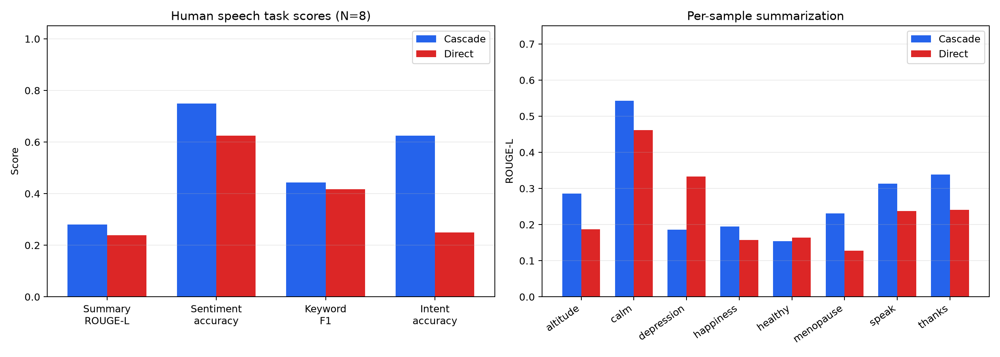

# Human Speech V1: Cascade vs Direct Report

[简体中文](human_speech_v1_report.zh-CN.md)

**Date:** 2026-07-02  
**Authors:** Jiayi Li（李佳宜）, Liu Luofei（刘洛菲）, Zhang Yuchen（张予辰）
**Scope:** 8 paired as-recorded English speech samples, 4 tasks  
**Status:** Preliminary descriptive pilot

## Executive Summary

Cascade achieved higher mean scores than Direct on all four metrics. The
largest observed difference was intent accuracy: 62.5% for Cascade versus
25.0% for Direct. Cascade also won 6 of 8 sample-level summarization
comparisons.

These results are not statistically conclusive. Every paired bootstrap 95%
interval for Direct minus Cascade crossed zero, and N=8 is too small for a
claim of statistical significance. The recordings contain uncontrolled
environmental and audience sounds and have no matched clean versions, so the
results cannot isolate a noise effect.

## Method

- Samples: `altitude`, `calm`, `depression`, `happiness`, `healthy`,
  `menopause`, `speak`, and `thanks`.
- Ground truth: human-supplied transcript, summary, sentiment, keywords, and
  intent.
- Cascade: supplied faster-whisper plus text-LLM results, including transcript.
- Direct: local Qwen2-Audio-7B INT4.
- Direct structured tasks: uniformly post-processed by DeepSeek using the same
  method as the existing white-noise workflow.
- Metrics: ROUGE-L, classification accuracy, exact-phrase keyword F1, and WER.

The supplied Cascade file matches all sample names and content, but contains no
audio hashes. Exact byte identity with the Direct inputs therefore cannot be
independently verified.

## Aggregate Results

| Task | Metric | Cascade | Direct | Direct - Cascade |
|---|---|---:|---:|---:|
| Summarization | ROUGE-L | 0.2807 | 0.2388 | -0.0419 |
| Sentiment | Accuracy | 75.0% (6/8) | 62.5% (5/8) | -12.5 pp |
| Keywords | Exact-phrase F1 | 0.4428 | 0.4167 | -0.0261 |
| Intent | Accuracy | 62.5% (5/8) | 25.0% (2/8) | -37.5 pp |

## Paired Results

| Task | Cascade wins | Direct wins | Ties | Direct - Cascade 95% bootstrap CI |
|---|---:|---:|---:|---:|
| Summarization | 6 | 2 | 0 | [-0.0882, 0.0211] |
| Sentiment | 2 | 1 | 5 | [-0.5000, 0.2500] |
| Keywords | 4 | 2 | 2 | [-0.1565, 0.1038] |
| Intent | 4 | 1 | 3 | [-0.8750, 0.1250] |

All intervals cross zero. The table supports a preliminary trend, not a
statistically established architecture difference.

## Per-Sample Scores

`C/D` means Cascade score followed by Direct score. Classification values are
0 for incorrect and 1 for correct.

| Sample | Summary C/D | Sentiment C/D | Keyword F1 C/D | Intent C/D | Cascade WER |
|---|---:|---:|---:|---:|---:|
| altitude | 0.2857 / 0.1875 | 1 / 0 | 0.0000 / 0.0000 | 1 / 0 | 0.0455 |
| calm | 0.5424 / 0.4615 | 1 / 1 | 0.8571 / 0.8571 | 1 / 0 | 0.0889 |
| depression | 0.1860 / 0.3333 | 0 / 0 | 0.3750 / 0.7143 | 0 / 1 | 0.0000 |
| happiness | 0.1944 / 0.1579 | 1 / 1 | 0.2500 / 0.3077 | 0 / 0 | 0.1600 |
| healthy | 0.1538 / 0.1639 | 0 / 1 | 0.3750 / 0.1818 | 1 / 0 | 0.0645 |
| menopause | 0.2308 / 0.1277 | 1 / 1 | 0.5714 / 0.5455 | 1 / 1 | 0.1522 |
| speak | 0.3137 / 0.2373 | 1 / 1 | 0.3636 / 0.0000 | 1 / 0 | 0.0727 |
| thanks | 0.3390 / 0.2414 | 1 / 0 | 0.7500 / 0.7273 | 0 / 0 | 0.0667 |

Mean Cascade WER was 0.0813. The implementation uses simple whitespace tokens,
so punctuation and tokenization can affect this number.

## Structured Output and API Use

- Cascade strict JSON after its text-LLM step: 24/24.
- Raw Qwen strict JSON: 0/24.
- Direct strict JSON after DeepSeek post-processing: 24/24.
- Successful Direct post-processing calls: 24.
- API usage: 1,832 prompt tokens and 478 completion tokens, 2,310 total.
- Historical project estimate: approximately $0.012; this is not a billing
  receipt.

## Latency

Recorded task means ranged from 16.239 to 18.290 seconds for Cascade and 1.462
to 4.481 seconds for Direct. These values must not be compared as architecture
speed:

- the two paths ran on different machines;
- the timing boundaries are not verified to match;
- Direct timing excludes model loading.

## Interpretation

The defensible result is that Cascade showed higher average quality on this
specific eight-sample human-speech set, especially for intent classification.
Direct nevertheless won individual cases, notably `depression` on
summarization, keywords, and intent.

Exact-phrase metrics can obscure semantic quality. For example, Cascade's
`altitude` keywords are relevant but receive zero F1 because their wording does
not exactly match the human keyword list. Likewise, ROUGE-L rewards lexical
overlap rather than factual correctness or readability.

No conclusion should attribute the differences to environmental noise, claim
statistical significance, or generalize the latency ordering to the two
architectures.

## B/C/D Ablation

An additional path used Qwen2-Audio for verbatim transcription before applying
the same DeepSeek task prompts as the Whisper cascade.

| Path | Summary ROUGE-L | Sentiment | Keyword F1 | Intent |
|---|---:|---:|---:|---:|
| B: Whisper transcript | 0.2807 | 75.0% | 0.4428 | 62.5% |
| C: Qwen transcript | 0.3064 | 75.0% | 0.3708 | 62.5% |
| D: Qwen direct | 0.2388 | 62.5% | 0.4167 | 25.0% |

Normalized WER was 0.0338 for Whisper and 0.0696 for Qwen. Despite Qwen's
higher WER, B and C had identical sentiment and intent correctness. C also
outperformed D on summary and intent. This suggests that neither WER nor the
presence of an intermediate transcript alone explains the system differences.

C versus D remains approximate because DeepSeek performs semantic tasks in C,
whereas Qwen performs semantic tasks in D. The Direct-minus-C summary bootstrap
interval was [-0.1506, -0.0010], narrowly excluding zero, but N=8 and multiple
comparisons require replication.

The formal C result uses 32 unique calls and 4,615 tokens. The complete audit
contains 52 calls and 7,541 tokens because a timed-out process continued while
manual resumptions overlapped. The historical all-call cost estimate is $0.026.

## Reproducibility Files

- `experiments/human_speech_v1.json`
- `experiments/HUMAN_SPEECH_V1.md`
- `data/ground_truth_human_v1.json`
- `data/processed/human_speech_v1/audio_manifest.json`
- `data/processed/human_speech_v1/as_recorded/*.wav`
- `data/results/human_speech_v1/cascade_raw.json`
- `data/results/human_speech_v1/direct_raw.jsonl`
- `data/results/human_speech_v1/direct_postprocessed.jsonl`
- `data/results/human_speech_v1/path_comparison_scores.csv`
- `data/results/human_speech_v1/path_comparison_summary.json`
- `data/results/human_speech_v1/qwen_transcription_raw.jsonl`
- `data/results/human_speech_v1/qwen_transcript_cascade_raw.jsonl`
- `data/results/human_speech_v1/bcd_ablation_summary.json`
- `compare_human_paths.py`
- `compare_human_bcd_ablation.py`
