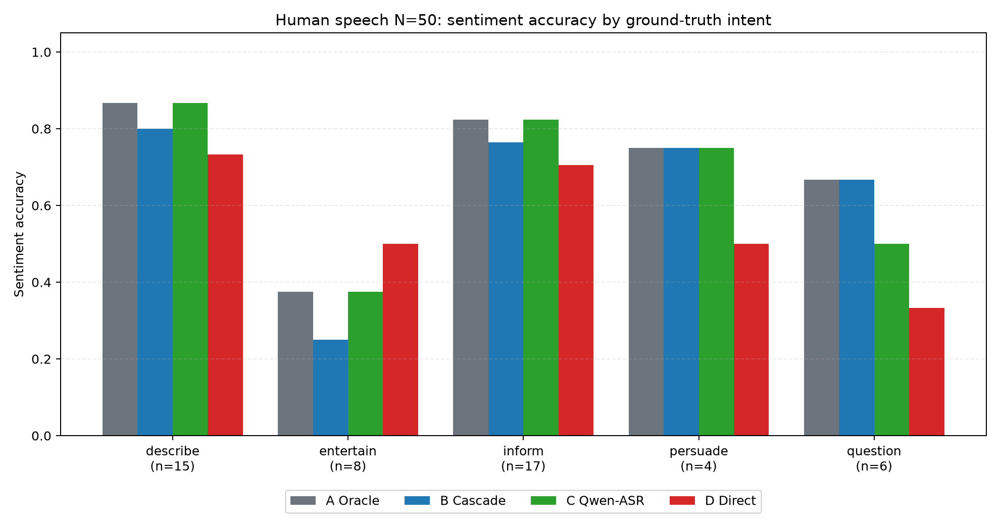
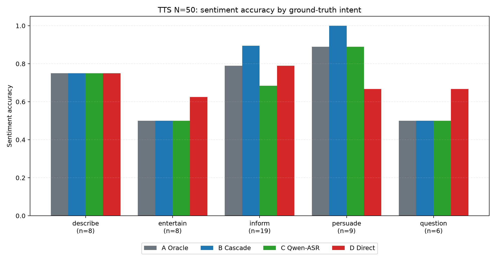
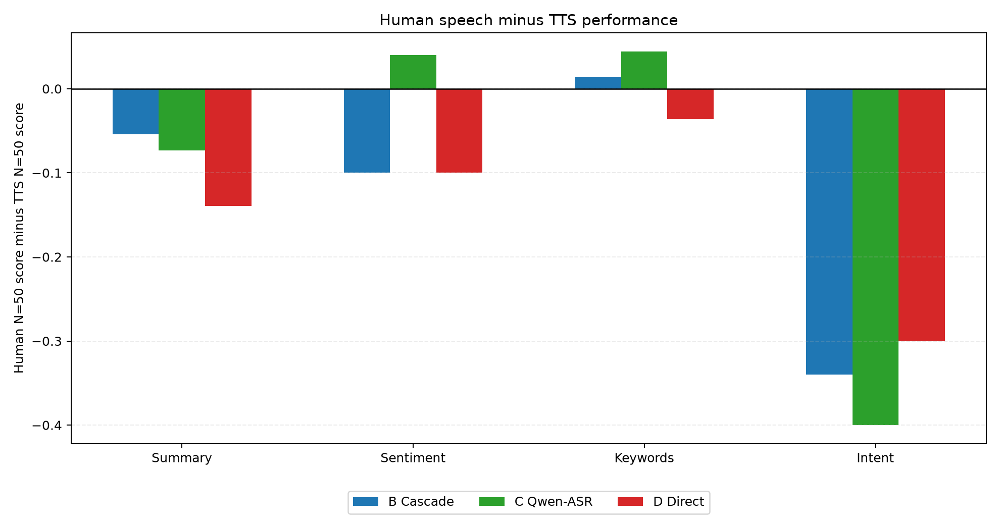

# Cascade vs End-to-End Speech Understanding: A Dual-Study Benchmark with N=50 TTS and N=50 Real-Human Speech

[简体中文](report.zh-CN.md)

**Authors:** Jiayi Li（李佳宜）, Liu Luofei（刘洛菲）, Zhang Yuchen（张予辰）  
**Date:** June-August 2026  
**Course:** Undergraduate Summer Research, Zhejiang University  
**Repository:** `github.com/jiayi0428/speech-benchmark`

## Abstract

We present a systematic comparison of cascade (ASR → LLM) and end-to-end speech understanding architectures through two parallel, equally sized benchmarks: **50 TTS-generated samples** and **50 real-human speech samples**. Four paths are evaluated on the same four tasks: A Oracle, B Whisper Cascade, C Qwen-ASR Cascade, and D Qwen-Direct.

The main result is architectural complementarity, not a single universal winner. On TTS, cascade is strongest for structured semantic tasks: B reaches **78% sentiment** and **98% intent**, while D reaches **72% sentiment** and **80% intent**. On real-human speech, A/B/C still outperform D overall, but D shows a clear local signal on prosody-heavy entertainment speech: in the human `entertain` subset, Direct sentiment reaches **50%**, ahead of B's **25%** and C's **37.5%**. This supports a task-conditioned interpretation: cascade is the stronger semantic baseline, while Direct contributes useful audio cues for affective, comedic, ironic, or delivery-heavy speech.

## 1. Methodology

All experiments use the same four tasks: summarization (ROUGE-L), sentiment classification, keyword extraction (F1), and intent classification. The four processing paths are:

| Path | Audio/Text source | Downstream reasoning |
|---|---|---|
| A Oracle | Ground-truth transcript | DeepSeek-chat |
| B Cascade | faster-whisper large-v3 transcript | DeepSeek-chat |
| C Qwen-ASR | Qwen2-Audio transcript | DeepSeek-chat |
| D Qwen-Direct | Qwen2-Audio direct audio analysis | DeepSeek structuring for structured tasks |

The final N=50 human set is derived from the N=66 human pool by removing 16 non-v5 `describe` samples. All v5 samples are retained, and the updated external v5 result file replaces the earlier local v5 results. The TTS set uses the 50-sample `TTS_50_results.json` result file.

Human intent distribution: `{'describe': 15, 'entertain': 8, 'inform': 17, 'persuade': 4, 'question': 6}`.  
TTS intent distribution: `{'describe': 8, 'entertain': 8, 'inform': 19, 'persuade': 9, 'question': 6}`.

## 2. TTS Benchmark (N=50)

| Path | Summary ROUGE-L | Sentiment Acc. | Keyword F1 | Intent Acc. |
|---|---:|---:|---:|---:|
| A Oracle (ground-truth transcript → DeepSeek) | 0.3291 | 72.0% | 0.3079 | 98.0% |
| B Cascade (Whisper → DeepSeek) | 0.3160 | 78.0% | 0.3188 | 98.0% |
| C Qwen-ASR (Qwen transcript → DeepSeek) | 0.3299 | 68.0% | 0.2978 | 94.0% |
| D Qwen-Direct (audio-native) | 0.3251 | 72.0% | 0.3124 | 80.0% |

TTS is the controlled condition: speech is clean, pronunciation is stable, and there is little room for prosody to add information beyond the transcript. The result is correspondingly clean: B/C are strong, and D is competitive for summarization but weaker for intent. The 18-point intent gap between B and D is the most important TTS result.

| Task | D-B | D-C | Reading |
|---|---:|---:|---|
| Summary | 0.0091 | -0.0048 | Direct trails |
| Sentiment | -0.0600 | 0.0400 | Direct trails |
| Keywords | -0.0064 | 0.0146 | Direct trails |
| Intent | -0.1800 | -0.1400 | Direct trails |

## 3. Human Speech Benchmark (N=50)

| Path | Summary ROUGE-L | Sentiment Acc. | Keyword F1 | Intent Acc. |
|---|---:|---:|---:|---:|
| A Oracle (ground-truth transcript → DeepSeek) | 0.2601 | 74.0% | 0.3914 | 64.0% |
| B Cascade (Whisper → DeepSeek) | 0.2621 | 68.0% | 0.3325 | 64.0% |
| C Qwen-ASR (Qwen transcript → DeepSeek) | 0.2564 | 72.0% | 0.3421 | 54.0% |
| D Qwen-Direct (audio-native) | 0.1854 | 62.0% | 0.2765 | 50.0% |

On real-human speech, A/B/C remain the stronger general-purpose choices. Direct drops especially on summarization, suggesting that noisy, naturalistic audio still challenges Qwen2-Audio direct comprehension. But the mean table hides the most important subgroup signal: Direct is useful in the specific region where tone and delivery carry meaning.

| Task | D-B | D-C | Reading |
|---|---:|---:|---|
| Summary | -0.0767 | -0.0710 | Direct trails |
| Sentiment | -0.0600 | -0.1000 | Direct trails |
| Keywords | -0.0559 | -0.0656 | Direct trails |
| Intent | -0.1400 | -0.0400 | Direct trails |

## 4. Per-Intent Findings

The strongest Direct signal is `entertain` sentiment:

| Path (entertain) | Summary | Sentiment | Keywords | Intent |
|---|---:|---:|---:|---:|
| B_whisper_cascade | 0.2003 | 25.0% | 0.2679 | 62.5% |
| C_qwen_transcript | 0.2062 | 37.5% | 0.3232 | 25.0% |
| D_qwen_direct | 0.1552 | 50.0% | 0.1483 | 25.0% |

Direct is not the best universal speech-understanding architecture. But it is not merely worse either. It wins the most plausible place for an audio-native model to win: human entertainment speech, where vocal delivery, irony, timing, and audience context affect sentiment. This is the central architectural insight.

## 5. Cross-Benchmark Comparison

TTS overstates how easy the real deployment problem is. B's sentiment drops from 78% on TTS to 68% on human speech, and D's summarization drops from 0.325 to 0.185. The gap is not just noise; it reflects natural recording artifacts, audience sound, delivery style, and messier real human speech.

## 6. Architectural Interpretation

The evidence does not support choosing one architecture for every task. Instead, the two designs expose different strengths:

| Condition | Stronger evidence |
|---|---|
| Clean TTS and content-driven speech | B Whisper Cascade is the stronger default |
| Summarization | B/C are safer on real-human speech; D is competitive mainly on clean TTS |
| Keywords | A/B/C are stronger, especially on real-human speech |
| Intent | B is strongest on TTS and tied with A on human speech |
| Entertainment / comedy / irony sentiment | D shows the clearest local advantage |

This should be read as an architectural complementarity result: text-based cascade paths are stronger for content semantics, while audio-native understanding can add value when paralinguistic cues affect the label.

## 7. Limitations

The N=50 results are much stronger than the earlier pilots, but they are still a project-scale benchmark. Only one model combination is tested per architecture family: Whisper large-v3, Qwen2-Audio-7B, and DeepSeek-chat. Human annotations do not include formal inter-annotator agreement. Per-intent subsets are uneven: `entertain` has 8 human samples and `persuade` has 4, so those subgroup conclusions should be treated as directional and should be expanded before broad claims.

## 8. Conclusion

Cascade is the better default architecture for the current four semantic tasks. It is especially strong for intent and keywords, and it remains robust on clean TTS. Direct's value is narrower but real: it can exploit paralinguistic information in entertainment-style human speech, especially for sentiment. The best interpretation is therefore not a single universal winner, but a task-conditioned trade-off: cascade for content semantics, Direct for selected prosody-heavy affective cases.

## Output files

- Human N=50 summary: `data/results/human_speech_final_n50/summary.json`
- Human N=50 scores: `data/results/human_speech_final_n50/scores.csv`
- TTS N=50 summary: `data/results/tts_speech_final_n50/summary.json`
- TTS N=50 scores: `data/results/tts_speech_final_n50/scores.csv`
