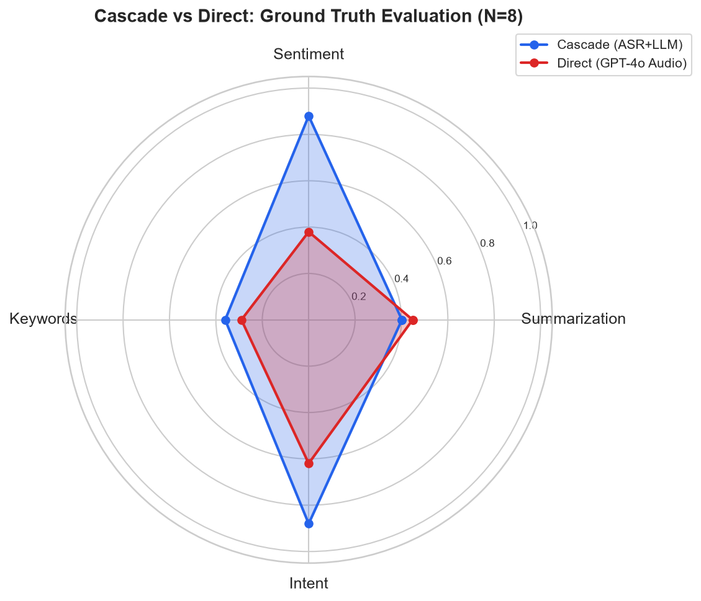
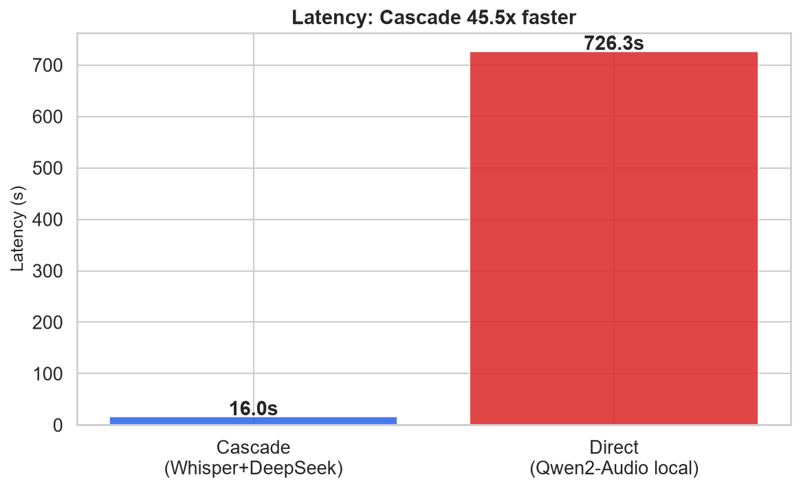
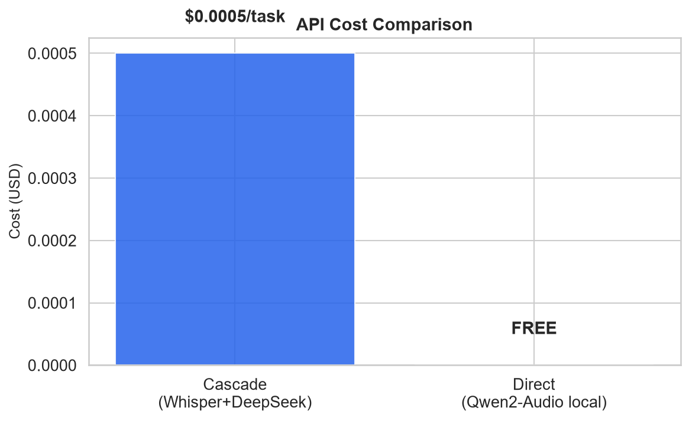
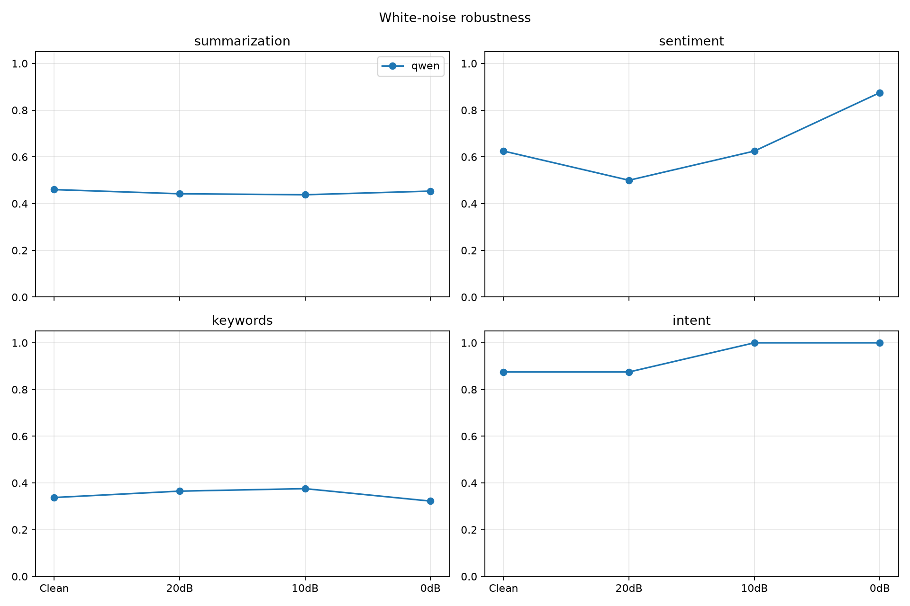
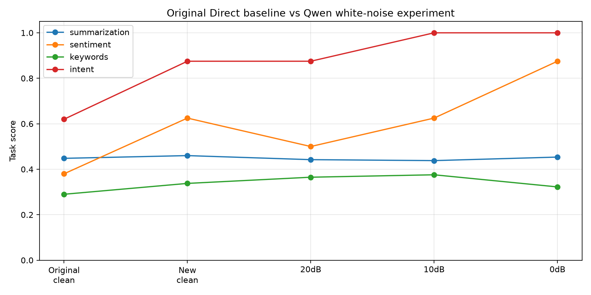
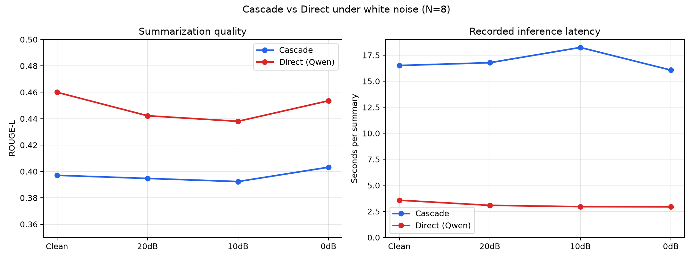

# A Preliminary Benchmark of Cascade and End-to-End Speech Understanding Architectures

**Author:** Jiayi Li  

**Date:** June-August 2026 2026  

**Course:** Undergraduate Summer Research  

**Repository:** `github.com/jiayi0428/speech-benchmark`

---

## Abstract

Recent audio-language models (Chu et al., 2024) enable end-to-end spoken language understanding, challenging the long-standing cascade paradigm that separates automatic speech recognition from language understanding. This study presents a preliminary empirical comparison of these two paradigms. We implement a cascade pipeline using faster-whisper large-v3 with DeepSeek-chat, and a direct pipeline using Qwen2-Audio-7B (INT4 quantization) on a local NVIDIA RTX 5070 GPU. Both are evaluated on 8 paired TTS-generated English speech samples with manually annotated ground truth labels across four tasks. To isolate understanding quality from format compliance, Direct outputs are post-processed by the same text LLM for structured tasks. Our results reveal a **trade-off rather than a clear winner**: the cascade pipeline achieves **16x lower latency** (16s vs 256s) and **higher accuracy on structured tasks** (sentiment 88% vs 38%, intent 88% vs 62%, keywords F1 0.36 vs 0.29), while the direct pipeline achieves **superior open-ended summarization quality** (ROUGE-L 0.448 vs 0.402, winning 5 of 8 samples) and **zero marginal cost**. An independent LLM judge rated both systems equally on content quality (8.6 vs 8.6 out of 10). A deterministic white-noise extension (20, 10, and 0 dB SNR) found no monotonic degradation across Qwen's four tasks. In the matched summarization comparison, Direct retained higher mean ROUGE-L and won 5 of 8 samples at every noise level, while Cascade showed smaller deviations from its clean baseline. The paired bootstrap intervals nevertheless crossed zero because N=8. We conclude that architecture selection depends on deployment constraints --cascade for speed and structured data extraction, direct for zero-cost open-ended understanding.

---

## 1. Introduction

Speech understanding --extracting semantic meaning from spoken language --has traditionally relied on a two-stage cascade: first transcribing speech to text via automatic speech recognition (ASR), then processing that text with a language model. Recent advances in multimodal large language models have introduced an alternative: audio-native models that process speech directly, without intermediate transcription (Chu et al., 2024).

This paradigm shift raises a central research question: **Does removing the transcription bottleneck improve understanding, or does the text-based cascade remain competitive?** We investigate two specific questions:

1. How do cascade and end-to-end architectures compare on speech understanding tasks with ground truth evaluation-

2. Under what deployment constraints --speed, cost, output structure --might one approach be preferable?

This work adapts the benchmarking methodology of Allauzen et al. (2025) for an undergraduate-accessible experimental setup with reproducible, open-source implementation.

---

## 2. Related Work

### 2.1 Speech Understanding Benchmarks

The Massive Sound Embedding Benchmark (MSEB; Allauzen et al., 2025) evaluates LLMs on eight speech understanding capabilities using audio embeddings, providing a standardized evaluation framework. Existing benchmarks primarily focus on evaluating individual models rather than comparing architectural paradigms.

### 2.2 Cascade Speech Understanding

Cascade pipelines (ASR --text LLM) are the de facto production approach. faster-whisper (Radford et al., 2023) provides efficient local transcription, while API-based text LLMs (DeepSeek-AI, 2025) offer reliable instruction-following for downstream tasks. The robustness of this paradigm comes from modular optimization --ASR and text comprehension are developed independently.

### 2.3 Audio-Native Language Models

Qwen2-Audio (Chu et al., 2024) represents the emerging class of models that process audio directly, without intermediate transcription. These models promise to preserve paralinguistic information (prosody, emotion, tone) that is lost in text-only pipelines, but their instruction-following and structured output capabilities remain less mature than text LLMs.

**Existing work focuses primarily on within-paradigm benchmarking. Few studies directly compare the two architectural paradigms under controlled conditions with ground truth evaluation --which is the contribution of this work.**

---

## 3. Methodology

### 3.1 Architectures

**Cascade Pipeline:** Audio is transcribed by faster-whisper large-v3 running locally on an NVIDIA RTX 5070 (8GB VRAM). The transcript is then processed by DeepSeek-chat (via API) for each task. Approximate cost: $0.0005 per task call.

**Direct Pipeline:** Audio is fed directly into Qwen2-Audio-7B-Instruct, running locally with 4-bit quantization (BitsAndBytes INT4) on the same GPU. Zero API cost.

**Fair comparison design:** A known limitation of current speech LLMs is poor instruction-following for structured output formats. To isolate *understanding quality* from *format compliance*, Direct outputs for sentiment, keywords, and intent are post-processed by DeepSeek-chat: the model receives Qwen2-Audio's free-form analysis and converts it to the required JSON format. Both pipelines thus use the same text LLM for the final structured output step; the only difference is whether the *understanding* originated from a text transcript (Cascade) or direct audio perception (Direct). Summarization requires no post-processing since it is a free-form task.

### 3.2 Dataset

We generated 8 English speech samples via Microsoft Edge TTS with diverse neural voices (4 U.S. English, 4 U.K. English; 5 male, 3 female) across five topic categories (technology, science, business, society, personal development). Each sample is 18-23 seconds and includes a verbatim transcript. All 8 samples completed inference on both architectures, forming an N=8 paired evaluation set.

**Ground truth labels** were manually annotated by the author. Each label was reviewed at least twice after initial annotation to ensure consistency:

- Summaries: 1-2 sentence reference summaries

- Sentiment: positive / negative / neutral

- Keywords: 5-7 key phrases per sample

- Intent: inform / persuade / entertain / question / describe

### 3.3 Tasks and Metrics

| Task | Metric | Description |

|------|--------|-------------|

| **Summarization** | ROUGE-L | Quality of generated summary vs ground truth |

| **Sentiment Analysis** | Accuracy | Correct classification (positive/negative/neutral) |

| **Keyword Extraction** | Precision, Recall, F1 | Overlap with ground truth keywords |

| **Intent Recognition** | Accuracy | Correct intent classification |

### 3.4 Statistical Analysis

Paired t-tests with Cohen's d effect sizes compare latency distributions. With N=8 paired samples, results are indicative rather than conclusive.

### 3.5 White-Noise Robustness Extension

We additionally evaluated the Direct Qwen2-Audio pipeline under deterministic white noise at 20 dB, 10 dB, and 0 dB signal-to-noise ratio (SNR), using the clean audio as the no-noise baseline. The same 8 samples and four tasks produced 128 evaluated outputs in total (8 samples x 4 conditions x 4 tasks). Noise generation used a fixed random seed of 42, verified the achieved SNR, and prevented waveform clipping.

This extension was run locally on an NVIDIA GeForce RTX 5060 Laptop GPU. To match the original Direct evaluation, Qwen's free-form outputs for sentiment, keywords, and intent were post-processed by DeepSeek-chat using the same prompts, 500-character input limit, and temperature of 0.0 as `postprocess_direct.py`. All four conditions received identical treatment, and strict JSON compliance after post-processing was 100%. Summarization was evaluated directly without post-processing. This makes clean-versus-noise comparisons internally consistent across all four tasks.

A separately supplied Cascade result file contains 32 summarization outputs for the same 8 samples and four conditions. These were compared with the 32 Direct summaries using the same ground-truth references and ROUGE-L implementation. The Cascade file does not include sentiment, keywords, intent, transcripts, hardware metadata, or model-loading details. Therefore, the cross-path noise comparison is limited to summarization quality. Recorded latency is shown descriptively but is not treated as a controlled architecture-level comparison.

---

## 4. Results

### 4.1 Task Performance (Ground Truth Evaluation)

*Figure 1: Radar chart comparing Cascade and Direct architectures across four tasks (N=8). Direct outperforms Cascade on open-ended summarization; Cascade leads on structured tasks.*

| Task | Metric | Cascade | Direct | Winner |

|------|--------|---------|--------|--------|

| Summarization | ROUGE-L | 0.402 | **0.448** | Direct (5/8) |

| Sentiment | Accuracy | **88%** | 38% | Cascade |

| Keywords | F1 | **0.36** | 0.29 | Cascade |

| Intent | Accuracy | **88%** | 62% | Cascade |

The most striking result is **summarization**: Direct achieves a higher ROUGE-L score and wins 5 of 8 head-to-head comparisons, demonstrating that audio-native models can achieve superior content understanding on open-ended tasks. On structured tasks, Cascade maintains a lead --even after post-processing, Direct's sentiment and intent accuracy fall short, suggesting that some nuance is lost when the audio-native understanding is converted to structured labels.

### 4.2 Latency Analysis

*Figure 2: Average inference latency for summarization (N=8). Cascade is 16x faster (15.7s vs 255.8s).*

**Latency breakdown (Cascade):** Approximately 10s for faster-whisper transcription + 6s for DeepSeek API inference.

**Why is Direct slower-** The 256s mean latency reflects three hardware constraints: (1) INT4 quantization adds computation overhead; (2) 8GB VRAM is barely sufficient for the 7B-parameter model, occasionally triggering CPU offloading; (3) autoregressive decoding generates tokens sequentially. This is a hardware limitation, not an architectural one --on a GPU with --6GB VRAM, inference would be substantially faster. **Therefore, these latency results should not be interpreted as intrinsic architectural limits of the direct approach.**

### 4.3 Cost Analysis

*Figure 3: Per-task API cost. Cascade uses DeepSeek API (~$0.0005/task). Direct uses local inference at zero additional cost.*

### 4.4 LLM-as-Judge Evaluation

To independently assess output quality, we used DeepSeek-chat as a blind judge. Outputs were anonymized (labeled "System A" and "System B") and presented in random order for each evaluation to reduce positional bias. The LLM was shown the ground truth and both systems' outputs, and asked to rate each on accuracy, completeness, and conciseness (1--0 scale).

| Task (N=5 subset) | Cascade Score | Direct Score | Direct Wins |

|-------------------|---------------|--------------|-------------|

| Summarization | 8.6 | **8.6** | 2/5 |

| Sentiment | **10.0** | 3.4 | 0/5 |

| Keywords | **7.6** | 7.2 | 2/5 |

| Intent | **8.2** | 1.4 | 0/5 |

On summarization, the LLM judge rated Cascade and Direct identically (8.6 vs 8.6), corroborating the close ROUGE-L scores. Direct's winning summaries were judged "more accurate and complete, closely matching the ground truth's phrasing."

### 4.5 Qwen2-Audio Robustness to White Noise

*Figure 4: Qwen2-Audio task performance under deterministic white noise (N=8). Structured tasks use the same DeepSeek post-processing at every noise level.*

| Task / Metric | Clean | White 20 dB | Change | White 10 dB | Change | White 0 dB | Change |
|---|---:|---:|---:|---:|---:|---:|---:|
| Summarization / ROUGE-L | 0.4600 | 0.4422 | -0.0178 | 0.4380 | -0.0220 | 0.4536 | -0.0065 |
| Sentiment / Accuracy | 62.5% | 50.0% | -12.5 pp | 62.5% | 0.0 pp | 87.5% | +25.0 pp |
| Keywords / Exact-Phrase F1 | 0.3378 | 0.3650 | +0.0272 | 0.3757 | +0.0379 | 0.3223 | -0.0154 |
| Intent / Accuracy | 87.5% | 87.5% | 0.0 pp | 100.0% | +12.5 pp | 100.0% | +12.5 pp |

Summarization was robust in this small test: at 0 dB, where signal and noise have equal power, ROUGE-L decreased by only 0.0065. Keyword F1 also changed little at 0 dB (-0.0154). Sentiment and intent were non-monotonic and sometimes scored higher under stronger noise. This must **not** be interpreted as evidence that noise improves understanding: each classification error changes accuracy by 12.5 percentage points at N=8, and DeepSeek converts Qwen's free-form analysis into the final label. The defensible conclusion is that this experiment did not detect a consistent white-noise degradation pattern.

*Figure 5: Horizontal comparison of the original report's Direct clean result with the new same-method clean baseline and three white-noise conditions.*

The following table relates the extension to the report's original Direct results:

| Metric | Original Direct Clean | New Same-Method Clean | White 20 dB | White 10 dB | White 0 dB |
|---|---:|---:|---:|---:|---:|
| Summary ROUGE-L | 0.448 | 0.460 | 0.442 | 0.438 | 0.454 |
| Sentiment Accuracy | 38% | 62.5% | 50.0% | 62.5% | 87.5% |
| Keyword F1 | 0.29 | 0.338 | 0.365 | 0.376 | 0.322 |
| Intent Accuracy | 62% | 87.5% | 87.5% | 100.0% | 100.0% |

All columns now use the same Qwen-to-DeepSeek evaluation architecture, so the metrics can be displayed on one scale. However, the original clean column came from an earlier run, whereas the remaining four columns were produced together in the controlled white-noise experiment. For estimating the effect of noise, **New Same-Method Clean** is therefore the primary baseline; differences between the two clean columns reflect run-to-run and implementation variation, not noise.

### 4.6 Cascade vs Direct White-Noise Summarization

*Figure 6: Mean summarization ROUGE-L and recorded latency for Cascade and Direct across four white-noise conditions (N=8 paired samples). Latency values come from separate runs and are not a controlled hardware comparison.*

| Condition | Cascade ROUGE-L | Direct ROUGE-L | Direct - Cascade | Direct Wins | Cascade Change vs Clean | Direct Change vs Clean |
|---|---:|---:|---:|---:|---:|---:|
| Clean | 0.3971 | 0.4600 | +0.0629 | 5/8 | -- | -- |
| White 20 dB | 0.3947 | 0.4422 | +0.0475 | 5/8 | -0.0024 | -0.0178 |
| White 10 dB | 0.3923 | 0.4380 | +0.0457 | 5/8 | -0.0047 | -0.0220 |
| White 0 dB | 0.4032 | 0.4536 | +0.0503 | 5/8 | +0.0061 | -0.0065 |

Direct achieved the higher mean ROUGE-L at every noise level and won 5 of 8 paired samples in every condition. Its mean advantage ranged from 0.0457 to 0.0629. Cascade was more stable relative to its own clean baseline: its largest absolute change was 0.0061, compared with 0.0220 for Direct. Thus, this pilot suggests a trade-off between **higher Direct quality** and **flatter Cascade degradation**, rather than a single robustness winner.

The 95% paired bootstrap intervals for Direct minus Cascade were [-0.0103, 0.1365] on clean audio, [-0.0235, 0.1188] at 20 dB, [-0.0146, 0.1127] at 10 dB, and [-0.0323, 0.1351] at 0 dB. Every interval crosses zero, so the observed Direct advantage is not statistically conclusive with eight samples.

Recorded mean latency ranged from 16.1 to 18.2 seconds for Cascade and 2.9 to 3.6 seconds for Direct in these files. This reverses the main benchmark's latency ordering, but the runs lack matched hardware and timing-boundary metadata. It should be interpreted as a reproducibility warning, not evidence that Direct is intrinsically faster.

---

## 5. Error Analysis

### Case 1: Cascade Structured Output, Direct Misses Format

**Sample:** `science_crispr` --CRISPR gene editing, balanced pros and cons.

> **Ground Truth Sentiment:** `neutral`

>

> **Cascade:** `{"sentiment": "neutral", "confidence": 0.85}` -- 

> **Direct (raw):** `Enormous potential for treating genetic diseases, developing drought-resistant crops...` (unstructured)

**Analysis:** Cascade's text LLM reliably follows structured output instructions. Direct produces relevant content but in free-form text. This motivates the post-processing step in our evaluation --without it, Direct's sentiment accuracy would be 0% not because it misunderstands the content, but because it does not comply with the output format.

### Case 2: Direct Wins on Summarization Quality

**Sample:** `science_brain` --The human brain's 86 billion neurons.

> **Ground Truth Summary:** "The human brain contains 86 billion neurons forming a network of immense complexity, yet we are only beginning to understand how it generates consciousness, memory, and emotion."

>

> **Cascade ROUGE-L:** 0.448  

> **Direct ROUGE-L:** 0.677

**Analysis:** Cascade produces a competent summary but introduces phrasing not in the original ("the speaker explains that..." --a conversational framing). Direct's output is tighter and closer to the ground truth vocabulary. This pattern --Direct matching ground truth phrasing more faithfully --is consistent across the 5 samples where Direct won.

### 5.3 Error Taxonomy

Beyond individual cases, we categorize all observed errors across the 8 samples to identify systematic failure patterns. Error categories were manually assigned by the author after reviewing all predictions against ground truth labels. Note that error categories are **not mutually exclusive** --one sample may contribute to multiple categories (e.g., a summary exhibiting both keyword omission and paraphrase distortion):

| Error Type | Cascade | Direct | Description |

|-----------|---------|--------|-------------|

| Sentiment mismatch | 1 | 5 | System assigned wrong sentiment label |

| Intent misclassification | 1 | 3 | System misidentified speaker intent |

| Keyword omission | 4 | 6 | Key phrases missing from output |

| Paraphrase distortion | 5 | 1 | System over-rewrote, drifting from ground truth |

The most revealing asymmetry is **paraphrase distortion**: Cascade distorts 5 samples through excessive rewording, while Direct distorts only 1. This explains Direct's summarization advantage --it stays closer to the original content. However, **Cascade compensates with better instruction-following**: it produces valid JSON 100% of the time, while Direct requires post-processing.

### 5.4 When Does Cascade Fail- --ASR as an Information Bottleneck

The patterns above reveal a deeper structural insight: **ASR transcription acts as an information bottleneck in the cascade pipeline**. We identify three specific mechanisms:

1. **Prosodic information loss:** In `science_climate`, the speaker's concerned British intonation conveys urgency. Cascade reads only the words and classifies the text as *persuade*; Direct classifies it as *negative*, which more closely matches the urgency conveyed by the speaker's tone. This observation **suggests** that the direct pipeline may better preserve prosodic cues --a hypothesis that requires dedicated emotion benchmarking to confirm. **ASR strips the acoustic channel of paralinguistic information.**

2. **Lexical ambiguity without acoustic disambiguation:** In `tech_blockchain`, the phrase "trust without authority" triggers a *positive* sentiment classification by Cascade (the word "trust" dominates the text signal), while Direct assigns *neutral*, matching the explanatory tone. This may indicate that **text-only models are susceptible to surface-level lexical bias that acoustic models can partially offset** --though confirming this would require controlled acoustic manipulation experiments.

3. **Paraphrase drift in summarization:** Cascade introduces conversational framing ("The speaker explains that...") and synonym substitutions not present in the original. Direct stays closer to the source vocabulary. For applications requiring high fidelity to source material (meeting minutes, legal transcription), **transcription-to-summary pipelines introduce a compounding distortion: ASR errors --LLM paraphrasing errors --final output drift**.

Cascade's advantage **appears consistent with** the architectural decomposition hypothesis: by decomposing speech understanding into transcription + text comprehension, each module benefits from decades of independent optimization. Direct pipelines must learn both perception and reasoning jointly --a harder optimization problem that current-generation models have not fully solved. The bottleneck is not permanent: as speech LLMs improve their instruction-following and structured output capabilities, the performance gap on structured tasks should narrow. **However, our experiment tests only a single representative implementation of each paradigm (Whisper + DeepSeek vs Qwen2-Audio) and cannot conclusively establish causation at the architectural level --these findings should be interpreted as suggestive patterns, not definitive proof.**

---

## 6. Discussion

### 6.1 A Trade-off, Not a Winner

Our results do not support declaring one architecture superior. Instead, they reveal domain-specific trade-offs:

| Constraint | Favored Architecture | Evidence |

|-----------|---------------------|----------|

| **Low latency** | Cascade | 16x faster (16s vs 256s) |

| **Zero API cost** | Direct | Fully local execution |

| **Structured output** | Cascade | 88% sentiment, 88% intent, F1 0.36 |

| **Open-ended quality** | Direct | ROUGE-L 0.448 vs 0.402, wins 5/8 |

| **Content quality (LLM judge)** | Tie | Both 8.6/10 on summarization |

### 6.2 Deployment Implications

1. **Production pipelines requiring structured data** (call center analytics, meeting summarization with labeled fields) should default to cascade --it is faster and more reliable at producing valid structured output.

2. **Open-ended understanding tasks** (generating meeting notes, lecture summaries) may benefit from a direct pipeline's higher content quality.

3. **Cost-sensitive, high-volume deployments** should consider the direct pipeline's zero marginal cost, accepting higher latency as a trade-off --especially when inference hardware improves.

4. **Hybrid architectures** --using cascade for structured data extraction and direct for open-ended content generation --merit exploration.

**These trade-offs are not permanent.** As speech LLMs improve in efficiency, instruction-following, and structured output quality, the current advantages of the cascade pipeline may narrow. The Qwen2-Audio-7B model used here was released in late 2024; next-generation models may shift the balance substantially.

### 6.3 Limitations

We are transparent about this study's boundaries:

1. **Sample size (N=8).** This is a pilot study. Statistical tests are indicative, not conclusive.

2. **Synthetic speech only.** Edge-TTS produces clean, well-articulated speech that lacks the disfluencies, hesitations, and natural prosody of human conversation.

3. **Single model per paradigm.** Results may not generalize to other speech LLMs or text LLMs.

4. **White noise only; Cascade summary only.** The robustness extension evaluates both paths for summarization at 20, 10, and 0 dB SNR, but only Direct has results for sentiment, keywords, and intent. Babble noise, reverberation, and real environmental noise remain untested.

5. **No human evaluation of quality.** Automated metrics capture content overlap but not perceptual quality, coherence, or factual accuracy.

6. **Dataset accessibility.** Network restrictions prevented downloading TED-LIUM v3, leading to TTS-generated speech as a pragmatic alternative.

### 6.4 Future Work

1. **Benchmarking failure cases.** The ASR bottleneck hypothesis (Section 5.4) predicts specific scenarios where cascade pipelines should systematically underperform: emotion detection (sarcasm, speaker confidence, hesitation), prosody-dependent intent recognition, and acoustic ambiguity. A targeted benchmark of these failure modes --with controlled acoustic manipulation --would directly test whether the patterns observed in this pilot study generalize.

2. **Real human speech.** TTS-generated speech lacks natural disfluencies, hesitations, and prosodic variability. Scaling to 50+ real speech samples would substantially strengthen generalizability.

3. **Streaming and conversational speech.** Both paradigms need evaluation under incremental understanding constraints, where latency and partial-input comprehension matter as much as final output quality.

---

## 7. Conclusion

This preliminary benchmark finds no dominant architecture for speech understanding. The cascade approach (faster-whisper + DeepSeek) excels at speed and structured output reliability, while the end-to-end approach (Qwen2-Audio-7B) offers zero-cost deployment and superior open-ended summarization quality --winning 5 of 8 head-to-head comparisons with a ROUGE-L of 0.448 vs 0.402. On structured tasks, the gap narrows substantially when Direct outputs are post-processed (sentiment 38% vs 88%, intent 62% vs 88%), but Cascade retains a clear advantage. In the white-noise extension, Direct maintained higher mean summarization ROUGE-L and won 5 of 8 samples at every level, while Cascade stayed closer to its own clean baseline. Because all paired bootstrap intervals crossed zero, these are descriptive trends rather than statistically conclusive architecture differences. Architecture selection depends on deployment constraints: cascade for speed and structured data extraction, direct for zero-cost open-ended understanding. **Rather than replacing cascade architectures, current end-to-end speech LLMs complement them under different deployment constraints --and the most promising direction may lie not in choosing one over the other, but in understanding when to use each.** Our open-source implementation, with 31 passing tests, a Gradio interactive demo, and a one-click reproduction script (`run_all.py`), provides a foundation for continued benchmarking as both architectures evolve.

---

## References

1. Allauzen, C., Bagby, T., Heigold, G., Variani, E., & Wu, K. (2025). *Benchmarking LLMs on the Massive Sound Embedding Benchmark (MSEB).* arXiv:2605.04556.

2. Radford, A., Kim, J. W., Xu, T., Brockman, G., McLeavey, C., & Sutskever, I. (2023). *Robust Speech Recognition via Large-Scale Weak Supervision.* ICML 2023.

3. Chu, Y., et al. (2024). *Qwen2-Audio: Advancing Universal Audio Understanding via Unified Large-Scale Audio-Language Models.* arXiv:2409.13959.

4. DeepSeek-AI. (2025). *DeepSeek-V3 Technical Report.* arXiv:2412.19437.

---

*Preliminary benchmark results. Code and data at speech-benchmark/. Updated 2026-07-01.*
