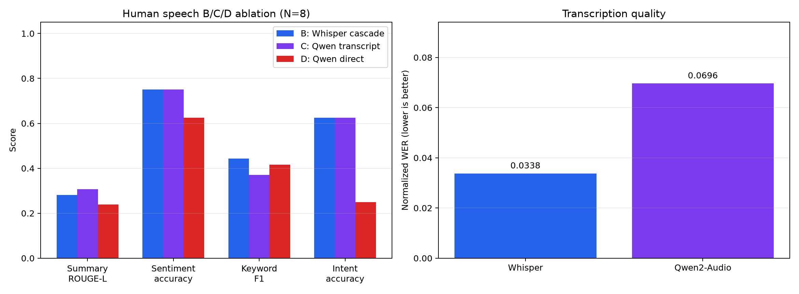
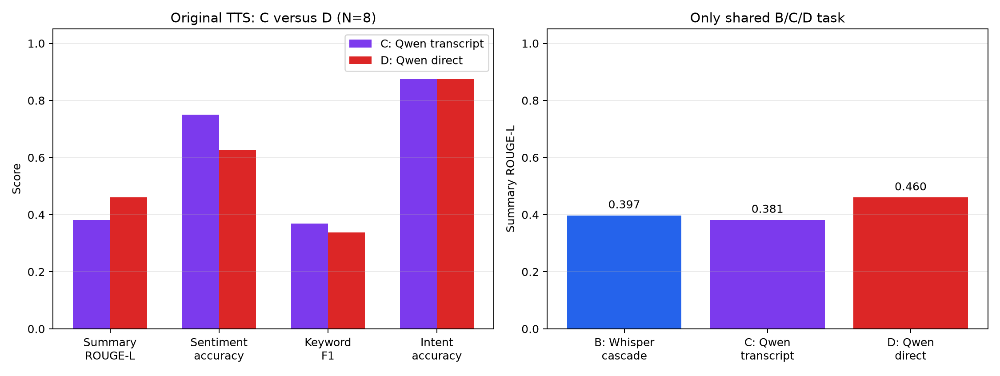
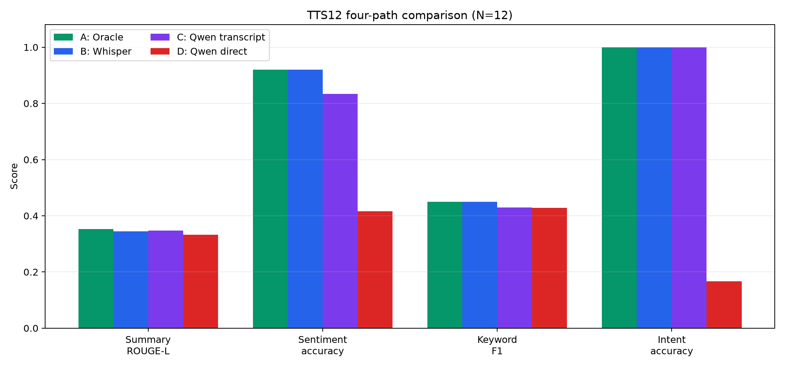

# 级联式与端到端语音理解架构的初步基准研究

[English](report.md)

**作者：** Jiayi Li、Liu Luofei（刘洛菲）、Zhang Yuchen（张予辰）

**日期：** 2026 年 6 月至 8 月  

**课程：** 本科暑期研究  

**代码仓库：** `github.com/jiayi0428/speech-benchmark`

---

## 摘要

近年来，音频语言模型的发展使端到端语音理解成为可能，并开始挑战“自动语音识别（ASR）后接文本理解模型”的传统级联范式。本研究对这两种范式进行了初步实证比较。级联路径采用 faster-whisper large-v3 与 DeepSeek-chat；Direct 路径采用在本地 NVIDIA RTX 5070 GPU 上以 INT4 运行的 Qwen2-Audio-7B。主实验使用 8 个成对的英文 TTS 样本和人工真值，在四项任务上进行评估。为了把理解能力与格式遵循能力分开，Direct 在情感、关键词和意图任务上的输出统一交给同一个文本 LLM 做结构化后处理。

结果呈现的是**权衡，而不是唯一赢家**。在原始同环境运行中，级联路径延迟约低 16 倍（16 秒对 256 秒），并在结构化任务上更准确：情感准确率为 88% 对 38%，意图准确率为 88% 对 62%，关键词 F1 为 0.36 对 0.29。Direct 在开放式摘要上更高，ROUGE-L 为 0.448 对 0.402，并在 8 个样本中赢得 5 个。本地 Direct 推理没有语音模型 API 费用，但结构化后处理仍使用付费文本 API。DeepSeek 评审模型对两条路径的摘要内容质量给出了相同均分 8.6/10。

确定性白噪声扩展在 20、10 和 0 dB SNR 下没有发现 Qwen 四项任务随噪声增强而单调下降的规律。在两路径摘要比较中，Direct 在每个噪声等级的平均 ROUGE-L 都更高，并始终赢得 5/8；Cascade 相对自身干净基线的变化更小。补充的真实人声配对实验中，Cascade 在四项指标上的均值都更高，但所有配对 bootstrap 区间都跨过 0。新增 N=12 TTS 实验比较 Oracle、Whisper 级联、Qwen 转写和 Qwen 直接理解四条路径，发现 A/B/C 接近，而 D 出现明显的意图分类失败。由于各数据集仍只有 N=8 或 N=12，结果只能作为描述性趋势，不能视为统计上确定的结论。

---

## 1. 引言

语音理解的目标是从口语中提取语义。传统系统通常采用两阶段级联：先通过自动语音识别把语音转成文字，再由语言模型处理文字。近年来，多模态大语言模型提供了另一条路径：直接处理音频，不产生显式的中间转写。

这一变化带来一个核心问题：

**去掉转写瓶颈能否改善语音理解，还是文本级联方案仍然具有竞争力？**

本研究关注两个具体问题：

1. 在具有人工真值的语音理解任务中，级联式与端到端架构表现如何？
2. 在速度、费用、输出结构等部署约束下，各自更适合什么场景？

本项目参考 Allauzen 等人（2025）的基准方法，建立了适合本科研究、可复现且开源的实验流程。

---

## 2. 相关工作

### 2.1 语音理解基准

Massive Sound Embedding Benchmark（MSEB；Allauzen 等，2025）使用音频嵌入评估大语言模型的八项语音理解能力，提供了标准化的评估框架。现有基准通常比较具体模型，较少直接比较不同架构范式。

### 2.2 级联式语音理解

级联流程（ASR → 文本 LLM）是实际生产中的常见方案。faster-whisper 提供高效本地转写，API 文本模型则具有较稳定的任务遵循能力。该范式的优势来自模块化：语音识别和文本理解可以分别优化。

### 2.3 音频原生语言模型

Qwen2-Audio 代表了一类直接处理音频的新模型。它们理论上可以保留文字转写会丢失的韵律、情绪和语调信息，但指令遵循和结构化输出能力通常还不如成熟的文本 LLM。

**现有研究更多关注同一范式内部的模型比较。使用人工真值，在受控条件下直接比较两种架构范式，是本项目希望补充的部分。**

---

## 3. 方法

### 3.1 架构

**Cascade 路径：** faster-whisper large-v3 在 NVIDIA RTX 5070（8 GB 显存）上本地转写音频，DeepSeek-chat 再通过 API 对转写文本执行各项任务。项目估计每次任务调用约为 0.0005 美元。

**Direct 路径：** 音频直接输入 Qwen2-Audio-7B-Instruct，并使用 BitsAndBytes INT4 在同一 GPU 上本地运行。语音模型推理本身不产生 API 费用；三个结构化任务仍使用 DeepSeek 后处理。

**公平比较设计：** 当前语音 LLM 的已知问题之一是结构化格式遵循能力较弱。为了区分“理解内容”和“输出合法 JSON”，Direct 的情感、关键词和意图输出交给 DeepSeek-chat 转换成要求的 JSON。两条路径因此在结构化任务的最后一步都使用相同文本模型，区别在于上游理解来自 ASR 文本还是直接音频感知。摘要是自由文本任务，不做后处理。

### 3.2 数据集

主实验使用 Microsoft Edge TTS 生成 8 个英文语音样本，包括 4 个美式英语声音和 4 个英式英语声音、5 个男性声音和 3 个女性声音，内容覆盖技术、科学、商业、社会和个人发展等主题。每段音频约 18 至 23 秒，并带有逐字稿。两条路径都完成了全部 8 个样本，构成 N=8 的配对评估集。

人工真值由作者标注，并在首次标注后至少复核两遍：

- 摘要：1 至 2 句参考摘要
- 情感：positive / negative / neutral
- 关键词：每段 5 至 7 个关键短语
- 意图：inform / persuade / entertain / question / describe

### 3.3 任务与指标

| 任务 | 指标 | 说明 |
|---|---|---|
| **摘要生成** | ROUGE-L | 生成摘要与人工参考摘要的重合度 |
| **情感分析** | 准确率 | 是否与 positive / negative / neutral 真值一致 |
| **关键词提取** | Precision、Recall、F1 | 与人工关键词短语的重合度 |
| **意图识别** | 准确率 | 是否与人工意图标签一致 |

### 3.4 统计分析

原实验使用配对 t 检验和 Cohen's d 比较延迟分布。由于只有 8 个成对样本，统计结果只能作为提示，不能视为确定结论。

### 3.5 白噪声鲁棒性扩展

项目进一步在 Direct Qwen2-Audio 路径上加入确定性白噪声，条件为干净、20 dB、10 dB 和 0 dB SNR。同一批 8 个样本和四项任务共产生 128 条评估输出，即 8 个样本 × 4 个条件 × 4 项任务。加噪使用固定随机种子 42，检查实际 SNR，并避免波形削波。

该扩展在 NVIDIA GeForce RTX 5060 Laptop GPU 上本地运行。为了匹配原 Direct 评估，情感、关键词和意图任务采用与 `postprocess_direct.py` 相同的提示词、500 字符输入上限和 0.0 温度，由 DeepSeek-chat 做后处理。四个条件采用完全相同的处理方式，后处理后的严格 JSON 合规率为 100%。摘要不做后处理。因此，Direct 内部的干净条件与加噪条件可以使用一致方法比较。

另一个单独提供的 Cascade 文件包含同一批 8 个样本、四个条件下的 32 条摘要结果。它们使用相同人工摘要和 ROUGE-L 实现与 Direct 的 32 条摘要比较。该文件不包含情感、关键词、意图、转写文本、硬件元数据或模型加载信息，所以跨路径噪声比较只能覆盖摘要质量。延迟仅作描述，不作为受控的架构速度比较。

---

## 4. 结果

### 4.1 基于人工真值的任务表现

*图 1：Cascade 与 Direct 在四项任务上的比较（N=8）。Direct 在开放式摘要上更高，Cascade 在结构化任务上领先。*

| 任务 | 指标 | Cascade | Direct | 较高者 |
|---|---|---:|---:|---|
| 摘要 | ROUGE-L | 0.402 | **0.448** | Direct（5/8） |
| 情感 | 准确率 | **88%** | 38% | Cascade |
| 关键词 | F1 | **0.36** | 0.29 | Cascade |
| 意图 | 准确率 | **88%** | 62% | Cascade |

最显眼的结果来自摘要：Direct 的 ROUGE-L 更高，并在 8 个逐样本比较中赢得 5 个。这说明音频原生模型在开放式任务上可以获得较好的内容理解表现。结构化任务中，Cascade 仍然领先；即使经过后处理，Direct 的情感和意图准确率仍然较低，说明音频原生理解在转换为结构化标签时可能损失了部分细节。

### 4.2 延迟分析

*图 2：原始同环境实验中的平均摘要延迟（N=8）。Cascade 约快 16 倍，即 15.7 秒对 255.8 秒。*

Cascade 的延迟大致包括约 10 秒 faster-whisper 转写和约 6 秒 DeepSeek API 推理。

Direct 的约 256 秒均值受到三项硬件条件影响：INT4 量化存在计算开销；8 GB 显存仅勉强容纳 7B 模型，可能触发 CPU 卸载；自回归生成需要逐 token 解码。因此，这一延迟反映具体硬件与实现，不应解释为 Direct 架构固有的速度极限。

### 4.3 成本分析

*图 3：单任务 API 成本。Cascade 使用 DeepSeek API，项目估计约 $0.0005/任务；Direct 的本地语音模型推理没有 API 成本。*

需要注意，Direct 的三个结构化任务仍使用付费文本 API 做后处理，所以“本地推理免费”不等于完整结构化流程完全没有费用。

### 4.4 LLM 评审

项目使用 DeepSeek-chat 作为盲评模型。输出被匿名标记为“系统 A”和“系统 B”，每次评估随机排列，以减小位置偏差。评审模型同时看到人工真值和两条路径的输出，并按准确性、完整性和简洁性评分。

| 任务（N=5 子集） | Cascade | Direct | Direct 胜出数 |
|---|---:|---:|---:|
| 摘要 | 8.6 | **8.6** | 2/5 |
| 情感 | **10.0** | 3.4 | 0/5 |
| 关键词 | **7.6** | 7.2 | 2/5 |
| 意图 | **8.2** | 1.4 | 0/5 |

摘要任务中，两条路径的平均评分均为 8.6，与接近的 ROUGE-L 结果相符。由于评审模型也是 DeepSeek，这并不是与系统完全独立的人工评价。

### 4.5 Qwen2-Audio 的白噪声鲁棒性

*图 4：Qwen2-Audio 在确定性白噪声下的任务表现（N=8）。所有噪声等级的结构化任务都使用相同 DeepSeek 后处理。*

| 任务 / 指标 | 干净 | 白噪声 20 dB | 变化 | 白噪声 10 dB | 变化 | 白噪声 0 dB | 变化 |
|---|---:|---:|---:|---:|---:|---:|---:|
| 摘要 / ROUGE-L | 0.4600 | 0.4422 | -0.0178 | 0.4380 | -0.0220 | 0.4536 | -0.0065 |
| 情感 / 准确率 | 62.5% | 50.0% | -12.5 pp | 62.5% | 0.0 pp | 87.5% | +25.0 pp |
| 关键词 / 精确短语 F1 | 0.3378 | 0.3650 | +0.0272 | 0.3757 | +0.0379 | 0.3223 | -0.0154 |
| 意图 / 准确率 | 87.5% | 87.5% | 0.0 pp | 100.0% | +12.5 pp | 100.0% | +12.5 pp |

在这项小规模测试中，摘要表现较稳定：在信号与噪声功率相等的 0 dB 条件下，ROUGE-L 只下降 0.0065。关键词 F1 在 0 dB 下也仅下降 0.0154。情感和意图不是单调变化，有时反而在更强噪声下得分更高。

这**不能**解释为噪声改善了理解。N=8 时，一个分类错误就会让准确率变化 12.5 个百分点，而且最终标签来自 DeepSeek 对 Qwen 自由文本的转换。可以支持的结论只是：这项实验没有检测到一致的白噪声退化模式。

*图 5：原报告 Direct 干净结果、新的同方法干净基线以及三个白噪声条件的横向展示。*

| 指标 | 原始 Direct 干净结果 | 新的同方法干净结果 | 白噪声 20 dB | 白噪声 10 dB | 白噪声 0 dB |
|---|---:|---:|---:|---:|---:|
| 摘要 ROUGE-L | 0.448 | 0.460 | 0.442 | 0.438 | 0.454 |
| 情感准确率 | 38% | 62.5% | 50.0% | 62.5% | 87.5% |
| 关键词 F1 | 0.29 | 0.338 | 0.365 | 0.376 | 0.322 |
| 意图准确率 | 62% | 87.5% | 87.5% | 100.0% | 100.0% |

这些列都使用 Qwen → DeepSeek 的评估结构，可以显示在同一指标尺度上。但是，原始干净结果来自更早的一次运行，其余四列来自同一次受控白噪声实验。估计噪声影响时，应以**新的同方法干净结果**为主基线。两个干净列之间的差异反映运行间与实现差异，不是噪声影响。

### 4.6 白噪声下的 Cascade 与 Direct 摘要比较

*图 6：四个白噪声条件下的平均摘要 ROUGE-L 和记录延迟（N=8 配对样本）。延迟来自不同运行环境，不是受控硬件比较。*

| 条件 | Cascade ROUGE-L | Direct ROUGE-L | Direct - Cascade | Direct 胜出 | Cascade 相对干净变化 | Direct 相对干净变化 |
|---|---:|---:|---:|---:|---:|---:|
| 干净 | 0.3971 | 0.4600 | +0.0629 | 5/8 | — | — |
| 白噪声 20 dB | 0.3947 | 0.4422 | +0.0475 | 5/8 | -0.0024 | -0.0178 |
| 白噪声 10 dB | 0.3923 | 0.4380 | +0.0457 | 5/8 | -0.0047 | -0.0220 |
| 白噪声 0 dB | 0.4032 | 0.4536 | +0.0503 | 5/8 | +0.0061 | -0.0065 |

Direct 在每个噪声等级的平均 ROUGE-L 都更高，并始终赢得 5/8。平均优势介于 0.0457 和 0.0629。Cascade 相对自身干净基线更平坦：最大绝对变化为 0.0061，而 Direct 为 0.0220。因此，这项先导实验显示的是“Direct 平均质量更高”和“Cascade 相对自身更稳定”之间的权衡，不存在单一鲁棒性赢家。

Direct 减 Cascade 的 95% 配对 bootstrap 区间分别为：干净条件 [-0.0103, 0.1365]、20 dB 条件 [-0.0235, 0.1188]、10 dB 条件 [-0.0146, 0.1127]、0 dB 条件 [-0.0323, 0.1351]。所有区间都跨过 0，所以 N=8 下 Direct 的观察优势没有统计确定性。

这些文件中的 Cascade 平均延迟为 16.1 至 18.2 秒，Direct 为 2.9 至 3.6 秒，与主基准的延迟排序相反。由于运行环境和计时边界不匹配，这只能视为复现性警告，不能作为 Direct 架构固有更快的证据。

### 4.7 真实录音上的 Cascade 与 Direct 配对先导实验

项目进一步在 8 段 17 至 23 秒的真实人声录音上评估两条路径。Direct 输入从 44.1 kHz 双声道转换为 16 kHz 单声道，不做降噪和峰值归一化，保留环境声和观众声。人工标注为每个样本提供逐字稿、摘要、情感、关键词和意图。外部提供的 Cascade 结果与 8 个样本的名称和内容一致，但不包含音频哈希，因此无法独立验证它与 Direct 输入是否逐字节完全相同。

*图 7：8 个真实人声样本上的人工真值任务得分和逐样本摘要 ROUGE-L。*

| 任务 | 指标 | Cascade | Direct | Direct - Cascade |
|---|---|---:|---:|---:|
| 摘要 | ROUGE-L | 0.2807 | 0.2388 | -0.0419 |
| 情感 | 准确率 | 75.0% | 62.5% | -12.5 pp |
| 关键词 | 精确短语 F1 | 0.4428 | 0.4167 | -0.0261 |
| 意图 | 准确率 | 62.5% | 25.0% | -37.5 pp |

Cascade 在四项指标上的均值都更高，并在摘要任务中赢得 6/8，Direct 赢得 2/8。情感、关键词和意图的 Cascade / Direct / 平局数量分别为 2/1/5、4/2/2 和 4/1/3。

但是，Direct 减 Cascade 的配对 bootstrap 95% 区间分别为：摘要 [-0.0882, 0.0211]、情感 [-0.5000, 0.2500]、关键词 [-0.1565, 0.1038]、意图 [-0.8750, 0.1250]。所有区间都跨过 0，因此观察到的 Cascade 优势只能作为描述性趋势。

Cascade 的平均 ASR WER 为 0.0813，使用项目的空格分词实现。Direct 经过统一 DeepSeek 后处理后，两条路径的严格 JSON 合规率都是 100%；Qwen 原始严格 JSON 合规率为 0/24。24 次成功后处理调用共使用 2,310 tokens。

记录的 Cascade 单任务均值延迟为 16.239 至 18.290 秒，Direct 为 1.462 至 4.481 秒。两者来自不同机器和计时边界，而且 Direct 不含模型加载，因此这些数字只能记录来源，不能解释为架构级速度差异。

这项配对实验没有匹配的干净录音，不能分离噪声影响。精确短语关键词 F1 也会低估语义相近但措辞不同的结果。例如，Cascade 在 `altitude` 上给出了相关关键词，却因没有与人工短语完全相同而得到 0 分。因此，较稳妥的结论是：在这 8 个真实录音上，Cascade 呈现初步优势，尤其是意图识别；但样本量和混杂因素不足以支持一般化的架构结论。

### 4.8 B/C/D 消融：差异究竟来自哪个组件？

为了减少“架构差异”和“音频模型能力差异”之间的混杂，实验增加了使用 Qwen2-Audio 做转写的第三条路径：

- **B：** 音频 → Whisper 转写 → DeepSeek 完成任务
- **C：** 音频 → Qwen2-Audio 转写 → DeepSeek 完成任务
- **D：** 音频 → Qwen2-Audio 直接理解 → DeepSeek 整理结构化格式

*图 8：B、C、D 三条路径的任务得分，以及 Whisper 与 Qwen 的规范化 WER。*

| 路径 | 摘要 ROUGE-L | 情感准确率 | 关键词 F1 | 意图准确率 |
|---|---:|---:|---:|---:|
| B：Whisper 转写 | 0.2807 | 75.0% | **0.4428** | 62.5% |
| C：Qwen 转写 | **0.3064** | **75.0%** | 0.3708 | **62.5%** |
| D：Qwen 直接理解 | 0.2388 | 62.5% | 0.4167 | 25.0% |

Qwen 的转写准确度低于 Whisper。删除固定元前缀并规范化标点后，Qwen 平均 WER 为 0.0696，Whisper 为 0.0338。尽管如此，B 与 C 在 8 个样本上的情感和意图正确性完全相同。C 的平均摘要 ROUGE-L 比 B 高 0.0257，但关键词 F1 低 0.0720；这两个配对区间都跨过 0。

与 D 相比，C 的摘要、情感和意图更高，D 的关键词 F1 更高。C 在摘要上赢得 6/8。Direct 减 C 的摘要配对 bootstrap 区间为 [-0.1506, -0.0010]，在这次重采样中刚好没有跨过 0。考虑到 N=8 和多重比较，这应视为值得复现的具体信号，而不是广泛的统计显著结论。

结果不支持“WER 更低就一定有更高下游得分”，也不支持“去掉转写一定更好”的简单说法。不过，C 与 D 仍不是纯粹的文字瓶颈干预：C 在转写后把语义任务交给 DeepSeek，而 D 由 Qwen 完成语义理解，DeepSeek 只整理结构化格式。

正式 C 结果包含 32 个唯一 API 响应和 4,615 tokens。由于一个超时进程继续在后台运行，而人工续跑同时启动，产生了 20 次重复调用。完整的 52 次调用、7,541 tokens 审计已经保留；按项目历史估算，费用约为 0.026 美元，而不是原计划的 0.016 美元。

---

### 4.9 原始 TTS 的 Qwen 转写消融实验

作为真实人声 B/C/D 消融的补充，本实验将原先 8 条干净 TTS 音频送入
C 路径：音频 -> Qwen2-Audio 转写 -> DeepSeek 完成四项任务。8 条转写
和 32 次下游调用全部成功。相对于原始 TTS 文稿，Qwen 清洗后的规范化
WER 为 0.0102。

*图 9：C 与 D 的四任务对照，以及存档结果中 B/C/D 唯一共同的摘要任务。*

| 路径 | 摘要 ROUGE-L | 情感准确率 | 关键词 F1 | 意图准确率 |
|---|---:|---:|---:|---:|
| B：Whisper 级联 | 0.3971 | 无可用结果 | 无可用结果 | 无可用结果 |
| C：Qwen 转写 -> DeepSeek | 0.3815 | 75.0% | 0.3694 | 87.5% |
| D：Qwen 直接理解 | 0.4600 | 62.5% | 0.3378 | 87.5% |

C 的情感和关键词均值高于 D，意图持平，摘要低于 D。D 赢得 5/8 个摘要，
C 赢得 6/8 个关键词比较。所有配对 bootstrap 区间均跨过 0，因此只能视为
N=8 下的描述性趋势，不能宣称统计显著。在 B/C/D 唯一共同的摘要任务上，
三者得分依次为 0.3971、0.3815 和 0.4600；与 B 有关的两个区间也都跨过 0。

现有 B 结果既没有保存 Whisper 转写，也没有逐样本结构化任务输出。因此，
本实验不能比较 Whisper 与 Qwen 在这些 TTS 音频上的 WER，也不能构造完整的
B/C/D 四任务表。B 和 D 来自更早的干净条件运行，C 则是本次新运行，所以
不比较延迟。32 次 DeepSeek 调用共使用 4,300 tokens，按项目历史估算约为
0.016 美元。

---

### 4.10 新增 12 条 TTS 的四路径比较

新增的 12 条干净 TTS 音频使用同一套真值，对比四条具体路径：

- **A（Oracle）：** 真值转写 -> DeepSeek 完成任务
- **B（Whisper 级联）：** 音频 -> Whisper 转写 -> DeepSeek 完成任务
- **C（Qwen 转写）：** 音频 -> Qwen2-Audio 转写 -> DeepSeek 完成任务
- **D（Qwen 直接理解）：** 音频 -> Qwen2-Audio 完成语义任务 -> DeepSeek
  整理结构化格式

*图 10：新增 TTS 数据集上的四路径任务均值（N=12）。*

| 路径 | 摘要 ROUGE-L | 情感准确率 | 关键词 F1 | 意图准确率 |
|---|---:|---:|---:|---:|
| A：Oracle 真值转写 | **0.3528** | **92%** | **0.4500** | **100%** |
| B：Whisper 级联 | 0.3448 | **92%** | **0.4500** | **100%** |
| C：Qwen 转写 | 0.3479 | 83.3% | 0.4298 | **100%** |
| D：Qwen 直接理解 | 0.3324 | 41.7% | 0.4286 | 16.7% |

A、B、C 三条路径非常接近。Oracle 比 Whisper 的摘要均值高 0.0079，
C 又比 B 高 0.0031。Qwen 的平均规范化转写 WER 为 0.0087。这说明在这批
干净合成语音上，Whisper 或 Qwen 的转写都没有形成明显的信息瓶颈。
Oracle 应被理解为“真值转写控制组”，而不是必然逐样本获胜的理论上限，
因为生成阶段本身仍存在差异。

D 在摘要和关键词 F1 上仍接近三条文本路径。C 和 D 的摘要各赢 6 条，
C-D 均值差为 0.0156，配对区间跨过 0。但 D 的情感和意图明显较低。
D 的原始意图输出把 12 条真值均为 `inform` 的说明性音频中的 10 条判为
`persuade`，所以 16.7% 的意图准确率来自语义分类，而不是 JSON 格式失败。

六组摘要配对区间全部跨过 0。C-D 的情感和意图区间在本次 bootstrap 中
没有跨过 0，但 N=12 且存在多重比较，仍不能宣称具有一般性的统计显著性；
它应被视为值得扩大样本复现的具体失败信号。

A/B 来源文件提供逐样本摘要分数，但情感、关键词和意图只有经过四舍五入
的总体值。因此，四路径均值可以作描述性比较，但不能计算涉及 A 或 B 的
结构化任务逐样本胜负和配对区间。C、D 的 84 次成功 DeepSeek 调用共使用
10,469 tokens，按项目历史单次估算约为 0.042 美元。不同路径的计时边界和
运行批次不同，因此不比较延迟。

---

## 5. 错误分析

### 案例 1：Cascade 输出结构正确，Direct 原始输出不符合格式

**样本：** `science_crispr`，内容是 CRISPR 基因编辑及其利弊。

> **情感真值：** `neutral`
>
> **Cascade：** `{"sentiment": "neutral", "confidence": 0.85}`
>
> **Direct 原始输出：** 关于治疗遗传疾病、培育抗旱作物等内容的自由文本分析。

Cascade 的文本 LLM 能稳定遵循结构化输出指令。Direct 输出内容相关，但不是要求的 JSON。这正是引入后处理的原因：如果完全按严格 JSON 解析，格式失败会被误算成理解失败。

### 案例 2：Direct 在摘要质量上胜出

**样本：** `science_brain`，内容是人脑的 860 亿个神经元。

> **参考摘要：** 人脑包含约 860 亿个神经元，形成极其复杂的网络；人类仍刚开始理解它如何产生意识、记忆和情绪。
>
> **Cascade ROUGE-L：** 0.448
>
> **Direct ROUGE-L：** 0.677

Cascade 生成了可用摘要，但加入了“说话者解释道”等原文没有的对话式框架。Direct 更简洁，也更接近人工真值的词汇。在 Direct 胜出的 5 个摘要样本中，可以观察到类似模式。

### 5.3 错误类型

作者逐项检查 8 个样本的预测，并人工归纳错误类型。不同类型并不互斥，一个样本可以同时出现关键词遗漏和改写偏移。

| 错误类型 | Cascade | Direct | 说明 |
|---|---:|---:|---|
| 情感不匹配 | 1 | 5 | 情感标签与真值不同 |
| 意图误分类 | 1 | 3 | 主要沟通意图判断错误 |
| 关键词遗漏 | 4 | 6 | 输出缺少关键短语 |
| 改写偏移 | 5 | 1 | 过度改写并偏离真值 |

最明显的不对称来自**改写偏移**：Cascade 有 5 个样本出现过度改写，Direct 只有 1 个。这可以解释 Direct 在原始 TTS 摘要上的优势。另一方面，Cascade 的指令遵循更稳定，能直接产生合法 JSON，而 Direct 需要后处理。

### 5.4 Cascade 何时失败：ASR 作为信息瓶颈

观察结果提示，ASR 转写可能成为级联流程的信息瓶颈，主要有三种机制：

1. **韵律信息丢失。** 在 `science_climate` 中，担忧的英式语调传达了紧迫感。Cascade 只能读取文字，而 Direct 理论上可以利用声学线索。这只是待验证假设，需要专门的情绪基准。
2. **缺少声学消歧。** 在 `tech_blockchain` 中，“trust without authority”可能让文本模型受“trust”一词影响；音频语调可能帮助判断整体是中性说明。不过，要确认这一点仍需受控声学操纵实验。
3. **摘要中的复合偏移。** 级联路径可能累积 ASR 错误、文本模型改写错误和最终输出偏移。对于会议纪要或法律记录等强调忠实度的场景，这种复合误差尤其重要。

Cascade 的结构化优势与模块化假设一致：语音识别和文本理解都经过长期独立优化。Direct 必须同时学习感知和推理，当前模型还没有完全解决这一问题。随着语音 LLM 的指令遵循和结构化能力提升，差距可能缩小。

但是，本项目每种范式只测试一个具体实现，即 Whisper + DeepSeek 与 Qwen2-Audio。实验不能在架构层面证明因果，只能报告这些具体系统上的提示性模式。

---

## 6. 讨论

### 6.1 权衡，而不是唯一赢家

原始 TTS 实验不支持宣布某种架构全面更好，而是显示任务和部署条件相关的权衡：

| 约束 | 更有利的路径 | 证据 |
|---|---|---|
| **低延迟（原始同环境运行）** | Cascade | 约 16 秒对 256 秒 |
| **本地语音模型推理** | Direct | 不需要语音模型 API |
| **结构化输出** | Cascade | 情感 88%、意图 88%、关键词 F1 0.36 |
| **开放式摘要质量** | Direct | ROUGE-L 0.448 对 0.402，赢 5/8 |
| **LLM 摘要评审** | 平局 | 两者均为 8.6/10 |

真实人声补充实验呈现了不同趋势：Cascade 在四项指标上的均值都更高。这再次说明结论对数据集和任务分布敏感。

### 6.2 部署启示

1. **需要结构化数据的生产流程**，如呼叫中心分析或带标签字段的会议摘要，可以优先考虑 Cascade。
2. **开放式内容理解任务**，如会议记录或课程摘要，可能受益于 Direct 的音频原生能力，但应先在目标数据上验证。
3. **成本敏感的大规模部署**需要同时计算本地硬件、电力和后处理 API；不能只把本地语音模型称为“完全免费”。
4. **混合架构**值得研究，例如 Cascade 负责结构化提取，Direct 负责开放式内容生成。

这些权衡不会永久不变。随着语音 LLM 在效率、指令遵循和结构化输出上的提升，当前 Cascade 的优势可能缩小。

### 6.3 局限性

1. **样本量较小（N=8 或 N=12）。** 所有实验都是先导研究，统计检验只能作为提示。
2. **主基准使用合成语音。** 主实验使用 Edge-TTS。真实人声补充实验也只有 8 段，没有匹配的干净录音，而且 Cascade 文件缺少音频哈希。
3. **每种范式只有一个模型组合。** 结果不一定能推广到其他语音 LLM、ASR 或文本 LLM。
4. **白噪声实验范围不完整。** 两路径都有摘要结果，但只有 Direct 拥有情感、关键词和意图结果。多人说话噪声、混响和受控真实环境噪声尚未执行。
5. **没有人工质量评分。** 自动指标衡量词汇重合或标签正确性，不能完整评价可读性、连贯性和事实准确性。
6. **数据可用性。** 网络限制阻止了 TED-LIUM v3 下载，因此主实验采用 TTS 作为务实替代。

### 6.4 未来工作

1. **针对失败模式建立基准。** 设计讽刺、说话者信心、犹豫、韵律依赖意图和声学歧义等受控任务，直接检验 ASR 瓶颈假设。
2. **扩大真实人声基准。** 将当前 8 个不可控录音扩展到 50 个以上，记录可验证的相同音频哈希，并提供成对的干净与加噪版本。
3. **流式和对话式语音。** 在增量输入场景下，同时评估部分输入理解、端到端延迟和最终质量。

---

## 7. 结论

这项初步基准没有发现普遍占优的语音理解架构。原始 TTS 实验中，Direct 的开放式摘要 ROUGE-L 更高（0.448 对 0.402），Cascade 则在结构化任务上领先。白噪声摘要扩展中，Direct 在每个等级的均值都更高并赢得 5/8，而 Cascade 相对自身干净基线更稳定。

在真实录音配对实验中，Cascade 在四项任务上的均值都高于原 Direct。随后的 B/C/D 消融发现：Qwen 转写 WER 高于 Whisper，但经过相同 DeepSeek 任务阶段后，B 与 C 的情感和意图正确性完全一致；Qwen 转写路径 C 在摘要和意图上也高于 Qwen 直接理解路径 D。因此，单凭 WER 或是否存在中间转写，都不能解释当前差异。大多数配对区间仍跨过 0，唯一刚好不跨 0 的摘要区间也需要在更大样本和多重比较控制下复现。

新增 N=12 四路径实验发现，干净 TTS 上的 A/B/C 结果接近；D 的摘要和关键词仍有竞争力，但意图分类出现明显失败。这进一步说明，转写误差或是否保留中间文本都不足以单独解释结果，同时把 Direct 的意图分类确定为值得复现的具体失败点。大多数配对区间仍跨过 0；少数未跨过 0 的区间也需要考虑小样本和多重比较，不能直接推广。

Direct 的本地语音模型推理可以避免语音模型 API 费用，但结构化评估仍使用付费 DeepSeek 后处理。现阶段，端到端语音 LLM 更适合作为级联系统的补充，而不是简单替代。更有价值的问题不是抽象地选择唯一赢家，而是确定在什么任务、数据和部署条件下使用哪条路径。

项目提供实验配置、原始输出、配对分数、图表和自动化检查，为后续更大规模、更受控的研究奠定了基础。

---

## 参考文献

1. Allauzen, C., Bagby, T., Heigold, G., Variani, E., & Wu, K. (2025). *Benchmarking LLMs on the Massive Sound Embedding Benchmark (MSEB).* arXiv:2605.04556.
2. Radford, A., Kim, J. W., Xu, T., Brockman, G., McLeavey, C., Sutskever, I. (2023). *Robust Speech Recognition via Large-Scale Weak Supervision.* ICML 2023.
3. Chu, Y., et al. (2024). *Qwen2-Audio: Advancing Universal Audio Understanding via Unified Large-Scale Audio-Language Models.* arXiv:2409.13959.
4. DeepSeek-AI. (2025). *DeepSeek-V3 Technical Report.* arXiv:2412.19437.

---

*初步基准结果。代码与数据位于 speech-benchmark/。更新于 2026-07-03。*
